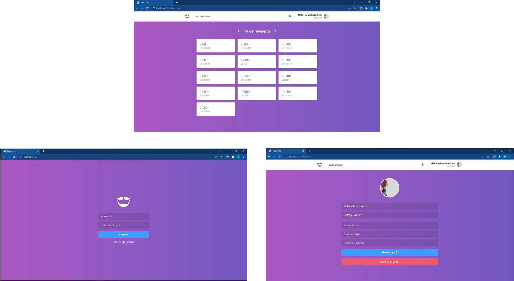

<div align="center">
    
  <h1>GoBarber</h1>
</div>
<p align="center">🚀 Appointment Management for Barber Services</p>
<p align="center">
  
  
  
  
</p>

<div align="center">
 <a href="#-objective">objective</a> •
 <a href="#-roadmap">roadmap</a> •
 <a href="#-technologies">technologies</a> •
 <a href="#-license">license</a> •
 <a href="#-author">author</a>
</div>

---
</br>
<p align="center">
  
</p>


## 💡 Objective
<p>The main purpose of this Web App is to connect service providers (barbers) to their customers, so they can more easily manage their appointments.</p>
<p>Basically, the web version of the project serves to inform service providers (barbers) about appointments made by their clients. It is possible to:</p>

- Manage provider account (Create, edit, login and logout)
- View appointments

> [Check the API](https://github.com/mathmelo/GoBarber-NodeJS)

> [Check the MOBILE version](https://github.com/mathmelo/GoBarber-React-Native)


## 🎌 Roadmap

### Prerequisites
Before starting, you will need to have the following tools installed on your machine:
<ul>
  <li><a href="https://nodejs.org/en/">Node</a></li>
</ul>

You can also use npm, but we seriously recommend yarn.

Also it's nice to have an editor to work with the code like [VSCode](https://code.visualstudio.com/).

### Running the server
**🚫 Important**
- To start this server, you will need to install and run the [GoBarber API](https://github.com/mathmelo/GoBarber-NodeJS)

**Execute the commands**

```bash
# Clone this repository
$ git clone https://github.com/mathmelo/GoBarber-React

# Access the project folder in the terminal/cmd
$cd GoBarber-React

# Install dependencies
$ yarn

# Run server
$ yarn start

# The server will start on port:3000 - go to <http://localhost:3000>
```

## 💜 Technologies
- Javascript
- ReactJS
- Redux, Redux Saga, Redux Persist
- Date Fns
- Styled Components
- Unform

## 📕 License

Read the license [here](https://github.com/mathmelo/GoBarber-React/blob/main/LICENSE).

## 🤓 Author

Informations about [me](https://github.com/mathmelo).
Send me a message! ;)

<br />
<br />

<h4 align="center">
	🚧  GoBarber 🚀 In construction...  🚧</br>
</h4>
